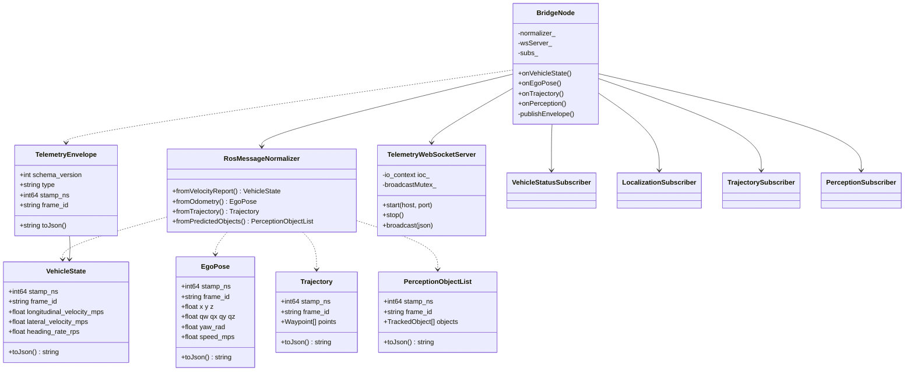

# Phase 1 — Class diagram

```mermaid
classDiagram
    direction TB

    class VehicleState {
        +int64 stamp_ns
        +string frame_id
        +float longitudinal_velocity_mps
        +float lateral_velocity_mps
        +float heading_rate_rps
        +toJson() string
    }
    class EgoPose {
        +int64 stamp_ns
        +string frame_id
        +float x y z
        +float qw qx qy qz
        +float yaw_rad
        +float speed_mps
        +toJson() string
    }
    class Trajectory {
        +int64 stamp_ns
        +string frame_id
        +Waypoint[] points
        +toJson() string
    }
    class PerceptionObjectList {
        +int64 stamp_ns
        +string frame_id
        +TrackedObject[] objects
        +toJson() string
    }
    class TelemetryEnvelope {
        +int schema_version
        +string type
        +int64 stamp_ns
        +string frame_id
        +string toJson()
    }

    class RosMessageNormalizer {
        +fromVelocityReport() VehicleState
        +fromOdometry() EgoPose
        +fromTrajectory() Trajectory
        +fromPredictedObjects() PerceptionObjectList
    }

    class TelemetryWebSocketServer {
        -io_context ioc_
        -broadcastMutex_
        +start(host, port)
        +stop()
        +broadcast(json)
    }

    class BridgeNode {
        -normalizer_
        -wsServer_
        -subs_
        +onVehicleState()
        +onEgoPose()
        +onTrajectory()
        +onPerception()
        -publishEnvelope()
    }

    class VehicleStatusSubscriber
    class LocalizationSubscriber
    class TrajectorySubscriber
    class PerceptionSubscriber

    BridgeNode --> RosMessageNormalizer
    BridgeNode --> TelemetryWebSocketServer
    BridgeNode --> VehicleStatusSubscriber
    BridgeNode --> LocalizationSubscriber
    BridgeNode --> TrajectorySubscriber
    BridgeNode --> PerceptionSubscriber

    RosMessageNormalizer ..> VehicleState
    RosMessageNormalizer ..> EgoPose
    RosMessageNormalizer ..> Trajectory
    RosMessageNormalizer ..> PerceptionObjectList

    BridgeNode ..> TelemetryEnvelope
    TelemetryEnvelope --> VehicleState
```
