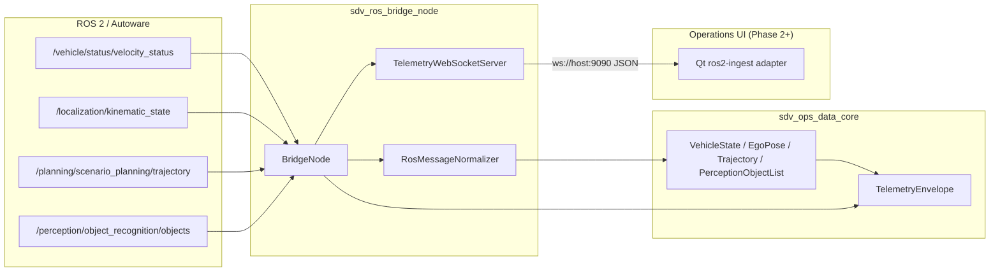

# Phase 1 — Component diagram

```mermaid
flowchart LR
  subgraph ROS2["ROS 2 / Autoware"]
    V["/vehicle/status/velocity_status"]
    L["/localization/kinematic_state"]
    T["/planning/scenario_planning/trajectory"]
    P["/perception/object_recognition/objects"]
  end

  subgraph Bridge["sdv_ros_bridge_node"]
    BN["BridgeNode"]
    N["RosMessageNormalizer"]
    WS["TelemetryWebSocketServer"]
    BN --> N
    BN --> WS
  end

  subgraph Core["sdv_ops_data_core"]
    D["VehicleState / EgoPose / Trajectory / PerceptionObjectList"]
    E["TelemetryEnvelope"]
    D --> E
  end

  subgraph Clients["Operations UI (Phase 2+)"]
    QT["Qt ros2-ingest adapter"]
  end

  V --> BN
  L --> BN
  T --> BN
  P --> BN
  N --> D
  BN --> E
  WS -->|"ws://host:9090 JSON"| QT
```
